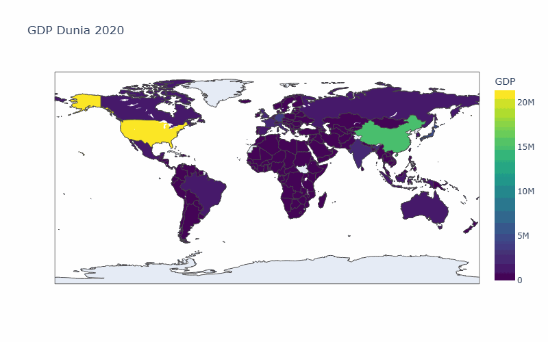
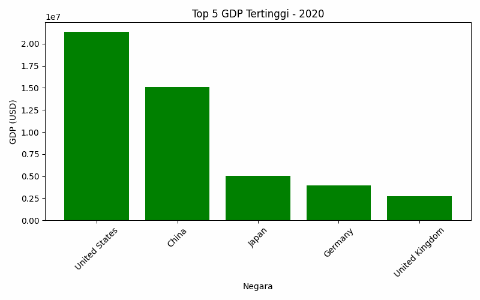
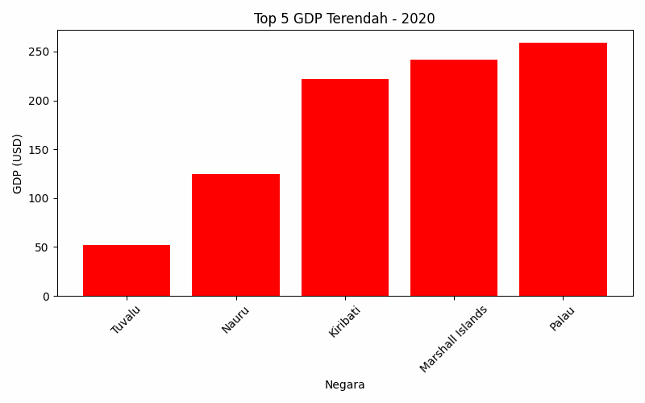

# GDP Visualization 2020-2025

Visualisasi **GDP dunia per negara** dari 2020–2025 dengan **GIF animasi**, **top/bottom 5 charts**, dan **peta dunia interaktif**.  



---

## Fitur
- **Peta Dunia Interaktif (HTML)** → zoom & hover negara  
- **GIF Peta Dunia** per tahun  
- **Top 5 & Bottom 5 GDP** per tahun (PNG + GIF)  
- **Otomatis update** saat data CSV baru ditambahkan  

---

## Struktur Project

gdp_visualization/
├─ data/
├─ outputs/
│ ├─ gdp_world_interaktif.html
│ ├─ gdp_world_map.gif
│ └─ top5_gdp_charts/
├─ src/
│ ├─ Main.py 
│ ├─ data_loader.py 
│ └─ plots.py 
├─ requirements.txt
└─ README.md


---

##  GIF & HTML Interaktif

**GIF Peta Dunia:**  


**Top 5 GDP GIF:**  


**Bottom 5 GDP GIF:**  


**HTML Interaktif:** buka di browser:  
[GDP World Interaktif](outputs/gdp_world_interaktif.html)

---


## Cara Pakai

1. Clone repo:
git clone https://github.com/farhansublimate-arch/gdp-visualization.git
cd gdp_visualization/src

2. Install requirements:
python -m pip install -r requirements.txt

3.Jalankan Main.py:
python Main.py

Semua GIF dan chart interaktif otomatis dibuat di folder outputs

```bash

Requirement:
Python 3.13+
Pandas, Plotly, Matplotlib, ImageIO, Kaleido, Numpy


Catatan:
-Output GIF / PNG tidak perlu commit → generate otomatis dari CSV
-Folder outputs/ bisa dimasukkan ke .gitignore agar repo ringan
-Bisa update data CSV kapan saja → jalankan Main.py → visualisasi baru otomatis dibuat


